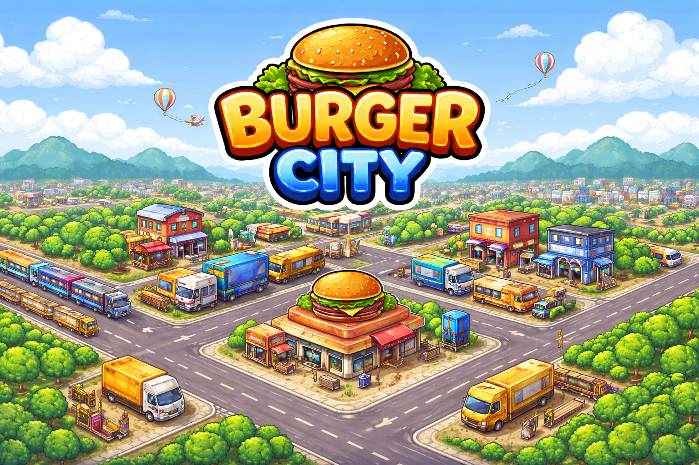
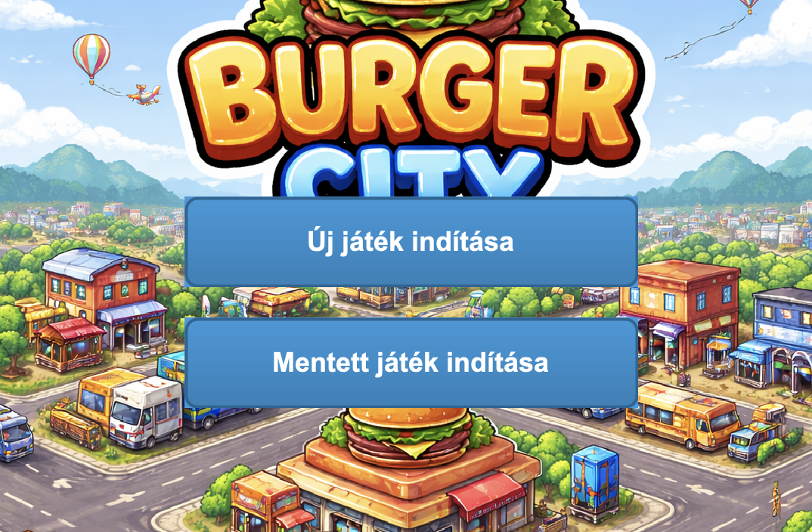
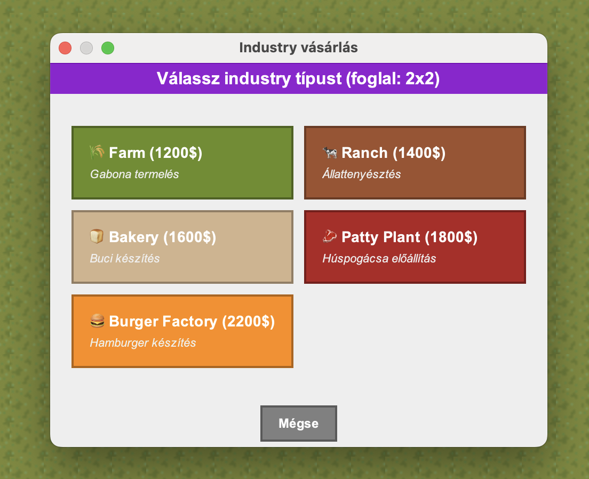
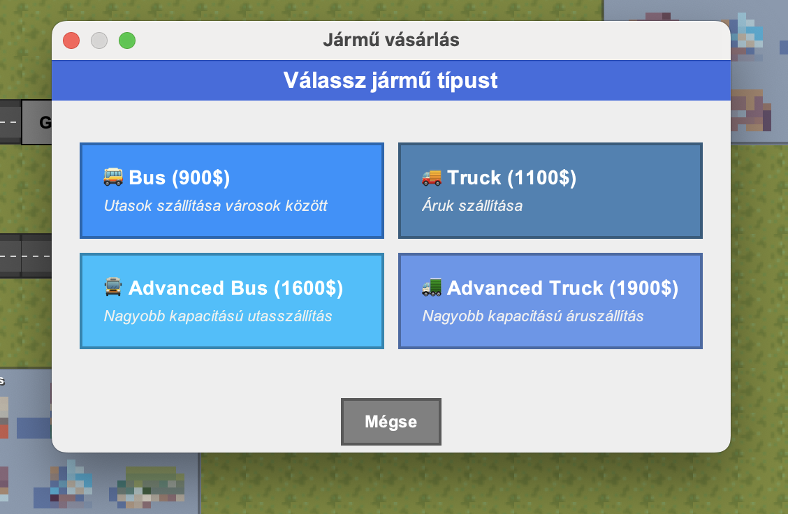
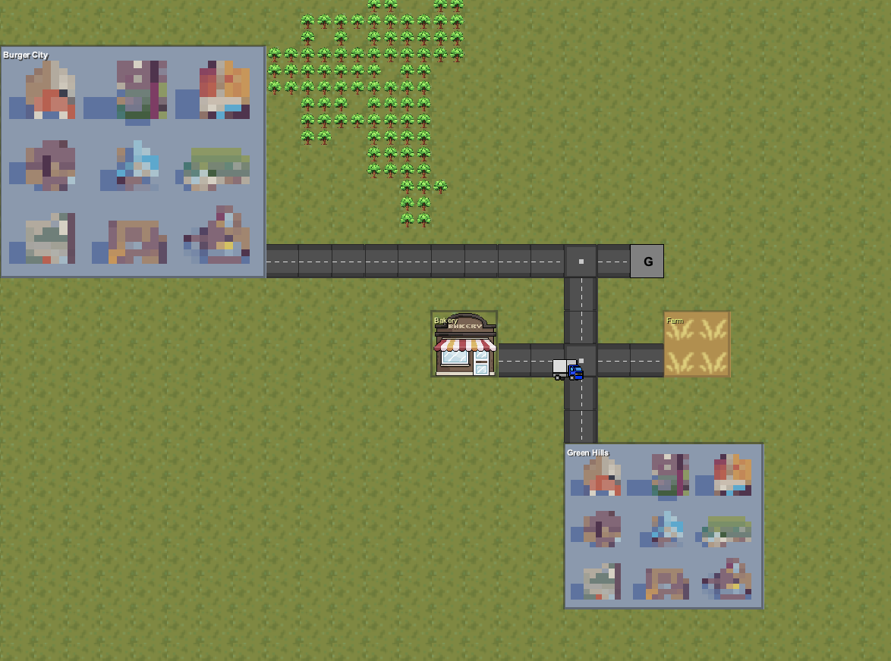

# Burger City

## A játék leírása

A játék lényege, hogy különböző gazdasági termelőépületeket építsünk, majd ezeket úthálózatokkal kössük össze. A játékos járműveket indíthat az utak között, amelyek az erőforrásokat egyik épületből a másikba szállítják a termelési folyamat során. A végső cél a hamburger előállítása, amelyet a városokba kell elszállítani a lehető legnagyobb profit érdekében. A játék középpontjában egy minél nagyobb, hatékonyabb és több pénzt termelő gazdasági rendszer kiépítése áll.

## Játék betöltése

Választhatunk már létező játék betöltése mellett, vagy új játékot is indíthatunk. Fontos, hogy mentsük a játékot!

A játékön belül a fenti gombokkal tudunk tevékenységeket választani.

## Építkezés

Építhetünk:
* Termelő épületeket
* Utakat
* Garázsokat
* Közlekedési lámpákat

## Jármű vásárlása

A járművásárlás opciót kiválasztva egy garázsra kattintunk. Ez után beállíthatjuk a játmű útvonalát, majd kiválaszthatjuk a típusát;
* Busz
* Kamion

## A játékmenet nyomonkövetése

A Dashboardról leolvasott információk alapján nyomon tudjuk követni a játék jelenlegi állapotát, és meg tudjuk hozni a szükséges döntéseket.

